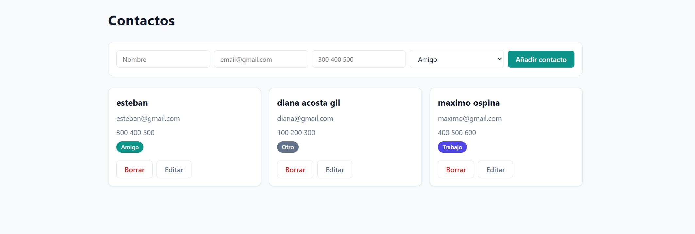

# Directorio de Contactos con CRUD Completo

app full stack de un Directorio de contactos con CRUD completo
incluye una API REST propia y una interfaz en React.



## Stack

- Backend: Node.js, Express
- Frontend: React, Vite
- Almacenamiento: array en memoria (sin base de datos)

## Caracteristicas

- CRUD completo de contactos contra API REST propia
- Validación de datos en cliente y servidor
- Edición mediante ventana modal
- Manejo de errores HTTP con mensajes del servidor visibles en la interfaz
- Estados de carga y de lista vacía
- Interfaz responsive construida con CSS Grid, sin media queries

## Instalación

1. Clona el repositorio

```bash
git clone https://github.com/estebanspy/directorio-contactos.git
```

2. Entra en la carpeta /backend e instala las dependencias

```bash
cd backend
npm install
```

3. arranca el servidor en la carpeta backend

```bash
npm run dev
```

4. En otra terminal, entra en la carpeta /frontend e instala las dependencias

```bash
cd frontend
npm install
```

5. Arranca el servidor de desarrollo

```bash
npm run dev
```

## Limitaciones conocidas

- Los datos se almacenan en un array en memoria: se pierden al reiniciar
  el servidor
- Sin autenticación ni control de acceso
- Sin paginación: la carga inicial trae todos los registros
- La lógica de negocio (validaciones, generación de ids) reside en los
  manejadores de ruta, sin separación en capas
- La ruta `GET /api/contactos/:id` está implementada en la API pero el
  frontend no la consume, ya que la lista completa está en memoria

## Mejoras futuras

- Persistencia en base de datos (MySQL o MongoDB)
- Separación en capas: rutas, controladores, servicios y repositorios
- Autenticación con JWT y roles de usuario
- React Router con vista de detalle por paciente
- Tests unitarios y de integración

## API

| Método | Ruta               | Éxito | Errores  |
| ------ | ------------------ | ----- | -------- |
| GET    | /api/contactos     | 200   | —        |
| GET    | /api/contactos/:id | 200   | 404      |
| POST   | /api/contactos     | 201   | 400      |
| PUT    | /api/contactos/:id | 200   | 400, 404 |
| DELETE | /api/contactos/:id | 204   | 404      |

### Modelo de Datos

```json
{
  "id": 1,
  "nombre": "juan",
  "email": "juan@gmail.com",
  "telefono": "+34 200 300 400",
  "tipoContacto": "amigo"
}
```

| Campo        | Tipo   | Obligatorio | Nota                                |
| ------------ | ------ | ----------- | ----------------------------------- |
| id           | number | -           | Generado por el servidor            |
| nombre       | string | Sí          |                                     |
| email        | string | No          |                                     |
| telefono     | string | Sí          |                                     |
| tipoContacto | string | Sí          | Valores: `amigo`, `trabajo`, `otro` |
